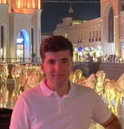

# CURRICULUM VITAE

Tolunay Kutlu
Herderstraat 17
9000 Gent
(+32) 489 49 08 31
tolunay.kutlu97@gmail.com

Ik ben Tolunay Kutlu. Ik studeer Graduaat Programming bij Arteveldehogeschool in Gent.
Mijn doel is om zo veel mogelijk bij te leren. Al jongs af altijd interrese gehad in website’s maken, designen. Mijn droom is altijd een Full-Stack developer te worden, en ik heb de kans gekregen om deze richting te kiezen.

---

### VAARDIGHEDEN

#### Beheersing van talen:
-	Nederlands: moedertaal.
-	Engels: Goed
-	Frans: Basiskennis

##### Beheersing van software en programmeertalen:
-	Zeer goed: Microsoft Word, IOS-Mac, Windows, Visual Studio Code.
-	Goed: Adobe Photoshop, Adobe XD, Adobe illustrator, HTML5, CSS3, internet browsers.
-	Op te frissen / Noties: Back-end: Data-Base, SQL, PHP, Etc.

##### Persoonelijke Vaardigheden:
-	**Leervermogen**: Ik ben iemand die veel notities neemt, bij het vergeten van informatie kan ik die dan terughalen. Durven is een plicht in het leven.
-	**Zelfontwikkeling**: Bewustzijn van wie ik ben en wat mijn sterktes en zwaktes zijn laten mij toe om te erkennen wat ik nodig heb. Op basis hiervan ben ik in staat om nieuwe competenties te ontwikkelen om mijn doel strategisch te benaderen. 
-	**Doorzettingsvermogen**: Hard werk en doorzetting zijn belangrijk om mijzelf te ontplooien, en ik ben in staat om door te zetten en ben altijd voorbereid om te groeien.
-	**Gepassioneerd**: Eens dat ik ben overtuigd van wat er gedaan moet worden, zal ik altijd ernaar streven om het beste resultaat uit te halen.

##### HOBBY’S
-	Opzoekingswerk: nieuwe programmeertalen leren, bezig zijn met de back-end gedeelte van de pagina.
-	Sporten o.a: Lopen, Fitnessen, Gamen
-	Designen met Adobe-programma, Logo’s creëren.

##### ERVARING
-	2016-2019: Volvo Cars in Gent 
		         John F. Kennedylaan 25: als operator 
-	2015-2016: Alternerende Stage Nam Noord Volkswagen in Gent 
        Leiekaai 18 9000 Gent: ik kan onderhoud en herstellen. 
-	2013-2014: Alternerende Stage Nam Noord Volkswagen in Gent 
        Leiekaai 18 9000 Gent: ik mag onderhoud doen. 
-	2012-2013: Blokstage Nam Noord Volkswagen in Gent 
        Leiekaai 18 9000 Gent: Ik was een hulp mecanicien 

##### STUDIES
-	2020 - Heden:  Graduaat Programmeren – Artevelde Hogeschool
		  JavaScript, HTML5, CSS3, Node.js, Express, Adobe XD, Web API’s, 	  	  Powershell, Github, Raspberry Pi, Linuxshell...
-	2015 - 2016: 3de Graad BSO KTA MoBi Gent Automechanica 
	           Coupure Rechts 312 9000 Gent 
-	2013 - 2015: 3de Graad BSO KTA MoBi Gent Automechanica  
-	2011 - 2013: 2de Graad BSO KTA MoBi Gent Basismechanica 
-	2010 - 2011: 2de jaar BSO Provinciale Middenschool in Gent 
	          Kantoor en Verkoop, Abdisstraat 56 9000 Gent  
-	2009 - 2010: 1ste jaar BSO Provinciale  Middenschool Gent 

